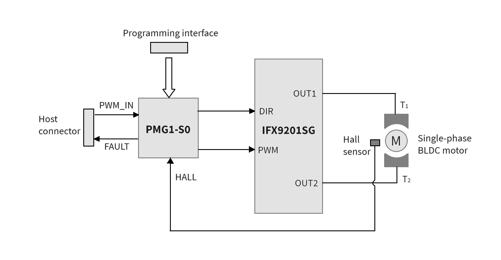
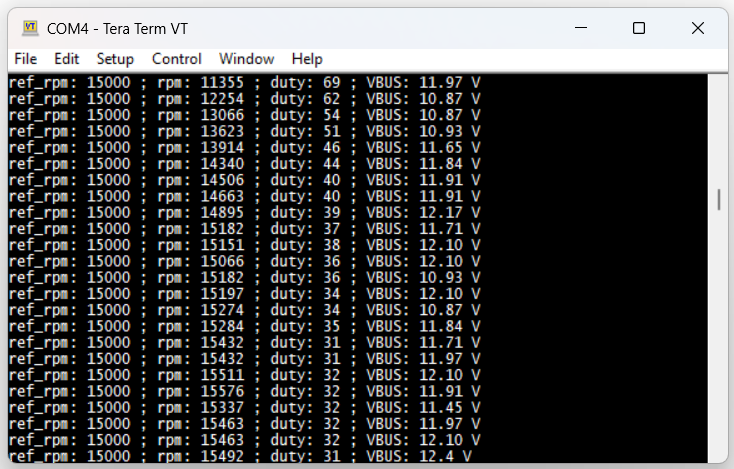
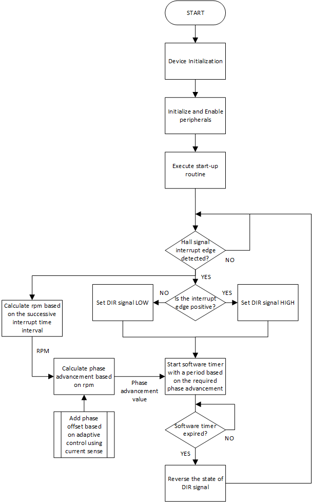
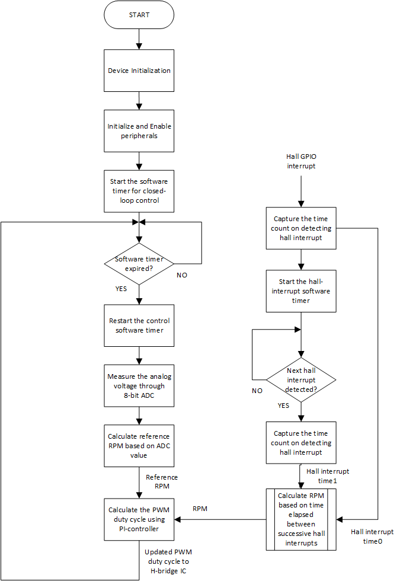

# EZ-PD&trade; PMG1 MCU: Single-phase BLDC motor control

This code example demonstrates using the EZ-PD&trade; PMG1-S0 microcontroller to build a closed-loop single-phase brushless (BLDC) motor control system with Hall sensor feedback, using MOTIX&trade; TLE9201SG 6A H-bridge motor driver.

[View this README on GitHub.](https://github.com/Infineon/mtb-example-pmg1-single-phase-bldc-motor-control)

[Provide feedback on this code example.](https://cypress.co1.qualtrics.com/jfe/form/SV_1NTns53sK2yiljn?Q_EED=eyJVbmlxdWUgRG9jIElkIjoiQ0UyMzk5NDciLCJTcGVjIE51bWJlciI6IjAwMi0zOTk0NyIsIkRvYyBUaXRsZSI6IkVaLVBEJnRyYWRlOyBQTUcxIE1DVTogU2luZ2xlLXBoYXNlIEJMREMgbW90b3IgY29udHJvbCIsInJpZCI6ImVhc292YXJnaGVzZSIsIkRvYyB2ZXJzaW9uIjoiMS4wLjAiLCJEb2MgTGFuZ3VhZ2UiOiJFbmdsaXNoIiwiRG9jIERpdmlzaW9uIjoiTUNEIiwiRG9jIEJVIjoiV0lSRUQiLCJEb2MgRmFtaWx5IjoiVFlQRS1DIn0=)


## Requirements

- [ModusToolbox&trade;](https://www.infineon.com/modustoolbox) v3.0 or later (tested with v3.2)
- Board support package (BSP) minimum required version: 3.1.0
- Programming language: C
- Associated parts: [EZ-PD&trade; PMG1-S0 MCU](https://www.infineon.com/cms/en/product/universal-serial-bus/usb-c-high-voltage-microcontrollers/ez-pd-pmg1-s0-high-voltage-mcu-with-usb-c-pd/)


## Supported toolchains (make variable 'TOOLCHAIN')

- GNU Arm&reg; Embedded Compiler v10.3.1 (`GCC_ARM`) – Default value of `TOOLCHAIN`
- Arm&reg; Compiler v6.16 (`ARM`)
- IAR C/C++ Compiler v9.30.1 (`IAR`)


## Supported kits (make variable 'TARGET')

- [EZ-PD&trade; PMG1-S0 Prototyping Kit](https://www.infineon.com/CY7110) (`PMG1-CY7110`) – Default value of `TARGET`


## Hardware setup

Requirements for hardware setup:

- [EZ-PD&trade; PMG1-S0 MCU](https://www.infineon.com/cms/en/product/universal-serial-bus/usb-c-high-voltage-microcontrollers/ez-pd-pmg1-s0-high-voltage-mcu-with-usb-c-pd/)

- [MOTIX&trade; TLE9201SG](https://www.infineon.com/cms/en/product/power/motor-control-ics/brushed-dc-motor-control-ics/integrated-full-bridge-ics/tle9201sg/) 6A H-bridge motor driver IC

- EZ-PD&trade; PMG1-S0 MCU-based reference schematics for motor control provided in the [AN240072](https://www.infineon.com/an240072) application note

- Single-phase BLDC motor (without internal driver IC)

1. See the [AN240072](https://www.infineon.com/an240072) application note to make the required hardware connections. **Table 1** shows the list of signal connections to the EZ-PD&trade; PMG1-S0 MCU (or CY7110 kit) from external circuit components.

**Table 1. GPIO connections required between EZ-PD&trade; PMG1-S0 MCU/CY7110 and TLE9201SG H-bridge IC**

 EZ-PD&trade; PMG1-S0 MCU pin | CY7110 | EZ-PD&trade; PMG1-S0 MCU I/O name  | EZ-PD&trade; PMG1-S0 MCU I/O | TLE9201SG driver input | Description
 ------------------- | ------ | ------------------ |------------------| ------------------|------------------
 P2.0 | J7.8 | PWM_OUT | Output | PWM | PWM control line to the motor driver
 P2.1 | J6.6 | HALL_IN | Input | - | Hall output signal from the motor/Hall sensor
 P2.2 | J7.7 | REF_RPM | Input | - | Analog reference RPM signal from low-pass filtered host PWM input or potentiometer
 P2.3 | J7.6 | VBUS_SENSE | Input | - | Analog DC bus voltage fraction to the ADC
 P3.0 | J7.4 | DIR | Output | DIR | Current direction control input to the motor driver
 P3.1 | J7.5 | FAULT | Output | - | Fault trigger signal to the host
 CSP | - | - | Input | - | Current sense input voltage to the low-side current sense amplifier (LS-CSA)
 P1.2 | J6.10 | UART_TX | Output | - | UART Tx signal to transmit the serial data (optional)

<br>

> **Note:** The reference schematics shown in the [AN240072](https://www.infineon.com/an240072) application note uses the EZ-PD&trade; PMG1-S0 MCU. Optionally, the CY7110 - EZ-PD&trade; PMG1-S0 Prototyping Kit can also be used to build this circuit with the TLE9201SG motor driver. However, CY7110 does not provide the CSP pin for current sensing; therefore, the associated firmware functionality cannot be used with the CY7110 kit.

2. Wire the two terminals of the single-phase BLDC motor to OUT0 and OUT1 output terminals on the hardware as shown in **Figure 1**.

3. Connect the output terminal of the Hall sensor to the HALL_OUT terminal of the hardware circuit as mentioned in the [AN240072](https://www.infineon.com/an240072) application note.

4. Connect a PWM input signal with the amplitude of 3.3 V, frequency of 15-20 kHz and variable duty cycle to the PWM_IN input pin on the J1 I/O header (see the circuit diagram in [AN240072](https://www.infineon.com/an240072)). Optionally, instead of a PWM signal, a 10 kohm potentiometer with side terminals connected to 3.3 V and GND and the center terminal connected to the P2.2 (REF_RPM) pin of the EZ-PD&trade; PMG1-S0 MCU can be used to feed an analog reference speed signal. 

5. Connect a suitable power supply with the positive terminal at the VBUS pin and the negative terminal at the GND pin of the hardware.

**Figure 1. Hardware block diagram**




## Software setup

Install a terminal emulator if you don't have one. Instructions in this document use [Tera Term](https://teratermproject.github.io/index-en.html).

This example requires no additional software or tools.


## Using the code example


### Create the project

The ModusToolbox&trade; tools package provides the Project Creator as both a GUI tool and a command line tool.

<details><summary><b>Use Project Creator GUI</b></summary>

1. Open the Project Creator GUI tool.

   There are several ways to do this, including launching it from the dashboard or from inside the Eclipse IDE. For more details, see the [Project Creator user guide](https://www.infineon.com/ModusToolboxProjectCreator) (locally available at *{ModusToolbox&trade; install directory}/tools_{version}/project-creator/docs/project-creator.pdf*).

2. On the **Choose Board Support Package (BSP)** page, select a kit supported by this code example. See [Supported kits](#supported-kits-make-variable-target).

   > **Note:** To use this code example for a kit not listed here, you may need to update the source files. If the kit does not have the required resources, the application may not work.

3. On the **Select Application** page:

   a. Select the **Applications(s) Root Path** and the **Target IDE**.

   > **Note:** Depending on how you open the Project Creator tool, these fields may be pre-selected for you.

   b. Select this code example from the list by enabling its check box.

   > **Note:** You can narrow the list of displayed examples by typing in the filter box.

   c. (Optional) Change the suggested **New Application Name** and **New BSP Name**.

   d. Click **Create** to complete the application creation process.

</details>


<details><summary><b>Use Project Creator CLI</b></summary>

The 'project-creator-cli' tool can be used to create applications from a CLI terminal or from within batch files or shell scripts. This tool is available in the *{ModusToolbox&trade; install directory}/tools_{version}/project-creator/* directory.

Use a CLI terminal to invoke the 'project-creator-cli' tool. On Windows, use the command-line 'modus-shell' program provided in the ModusToolbox&trade; installation instead of a standard Windows command-line application. This shell provides access to all ModusToolbox&trade; tools. You can access it by typing "modus-shell" in the search box in the Windows menu. In Linux and macOS, you can use any terminal application.

The following example clones the "[Single-phase BLDC motor control](https://github.com/Infineon/mtb-example-pmg1-single-phase-bldc-motor-control)" application with the desired name "SinglePhaseBLDCMotorControl" configured for the *PMG1-CY7110* BSP into the specified working directory, *C:/mtb_projects*:

   ```
 project-creator-cli --board-id PMG1-CY7110 --app-id mtb-example-pmg1-single-phase-bldc-motor-control --user-app-name SinglePhaseBLDCMotorControl --target-dir "C:/mtb_projects"
   ```


The 'project-creator-cli' tool has the following arguments:

Argument | Description | Required/optional
---------|-------------|-----------
`--board-id` | Defined in the <id> field of the [BSP](https://github.com/Infineon?q=bsp-manifest&type=&language=&sort=) manifest | Required
`--app-id`   | Defined in the <id> field of the [CE](https://github.com/Infineon?q=ce-manifest&type=&language=&sort=) manifest | Required
`--target-dir`| Specify the directory in which the application is to be created if you prefer not to use the default current working directory | Optional
`--user-app-name`| Specify the name of the application if you prefer to have a name other than the example's default name | Optional

<br>

> **Note:** The project-creator-cli tool uses the `git clone` and `make getlibs` commands to fetch the repository and import the required libraries. For details, see the "Project creator tools" section of the [ModusToolbox&trade; tools package user guide](https://www.infineon.com/ModusToolboxUserGuide) (locally available at {ModusToolbox&trade; install directory}/docs_{version}/mtb_user_guide.pdf).

</details>


### Open the project

After the project has been created, you can open it in your preferred development environment.

<details><summary><b>Eclipse IDE</b></summary>

If you opened the Project Creator tool from the included Eclipse IDE, the project will open in Eclipse automatically.

For more details, see the [Eclipse IDE for ModusToolbox&trade; user guide](https://www.infineon.com/MTBEclipseIDEUserGuide) (locally available at *{ModusToolbox&trade; install directory}/docs_{version}/mt_ide_user_guide.pdf*).

</details>


<details><summary><b>Visual Studio (VS) Code</b></summary>

Launch VS Code manually, and then open the generated *{project-name}.code-workspace* file located in the project directory.

For more details, see the [Visual Studio Code for ModusToolbox&trade; user guide](https://www.infineon.com/MTBVSCodeUserGuide) (locally available at *{ModusToolbox&trade; install directory}/docs_{version}/mt_vscode_user_guide.pdf*).

</details>


<details><summary><b>Keil µVision</b></summary>

Double-click the generated *{project-name}.cprj* file to launch the Keil µVision IDE.

For more details, see the [Keil µVision for ModusToolbox&trade; user guide](https://www.infineon.com/MTBuVisionUserGuide) (locally available at *{ModusToolbox&trade; install directory}/docs_{version}/mt_uvision_user_guide.pdf*).

</details>


<details><summary><b>IAR Embedded Workbench</b></summary>

Open IAR Embedded Workbench manually, and create a new project. Then select the generated *{project-name}.ipcf* file located in the project directory.

For more details, see the [IAR Embedded Workbench for ModusToolbox&trade; user guide](https://www.infineon.com/MTBIARUserGuide) (locally available at *{ModusToolbox&trade; install directory}/docs_{version}/mt_iar_user_guide.pdf*).

</details>

<details><summary><b>Command line</b></summary>

If you prefer to use the CLI, open the appropriate terminal, and navigate to the project directory. On Windows, use the command-line 'modus-shell' program; on Linux and macOS, you can use any terminal application. From there, you can run various `make` commands.

For more details, see the [ModusToolbox&trade; tools package user guide](https://www.infineon.com/ModusToolboxUserGuide) (locally available at *{ModusToolbox&trade; install directory}/docs_{version}/mtb_user_guide.pdf*).

</details>


## Operation

1. Connect the mode selection jumper (J2) on the hardware at position 1-2 to enable programming mode. Remove all other external power connections to the hardware.

2. Connect a MiniProg4 programmer to the programming header (J3) on the hardware.

3. Plug in a Type-C cable from the host PC to the MiniProg4 programmer.

4. Program the kit using one of the following:

   <details><summary><b>Using Eclipse IDE</b></summary>

      1. Select the application project in the Project Explorer.

      2. In the **Quick Panel**, scroll down, and click **\<Application Name> Program (KitProg3_MiniProg4)**.
   </details>


   <details><summary><b>In other IDEs</b></summary>

   Follow the instructions in your preferred IDE.
   </details>


   <details><summary><b>Using CLI</b></summary>

     From the terminal, execute the `make program` command to build and program the application using the default toolchain to the default target. The default toolchain is specified in the application's Makefile but you can override this value manually:
      ```
      make program TOOLCHAIN=<toolchain>
      ```

      Example:
      ```
      make program TOOLCHAIN=GCC_ARM
      ```
   </details>

> **Note:** PMG1-S0 MCU does not have a reset pin. Therefore, use a power-cycle programming method to ensure successful programming. See section 5.4.1 of [EZ-PD&trade; PMG1 MCU prototyping kits guide](https://www.infineon.com/dgdl/Infineon-CY7110_CY7111_CY7112_EZ-PD_PMG1_Prototyping_Kit_Guide-UserManual-v01_03-EN.pdf?fileId=8ac78c8c7d0d8da4017d0fb2ee922768) for more details on power-cycle programming using ModusToolbox&trade;.

5. Remove the MiniProg4 programmer after programming the hardware.

6. Remove the mode selection jumper (J2) from position 1-2.

7. Connect the input power supply across VBUS and GND terminals on the hardware. 

8. Turn on the power supply to start the motor.

9. Vary the duty cycle of the PWM signal connected to the PWM_IN input on the J1 header to control the speed of the motor in closed-loop operation. If a potentiometer is connected to the REF_RPM (P2.2) of the EZ-PD&trade; PMG1-S0 MCU, rotate the potentiometer to input a variable analog reference speed signal to control the speed of the motor.

10. Modify the control configuration macros to alter the functionalities and to tune the control system (see **Table 2** in the [Firmware design](#firmware-design) section).

11. Do the following to view the run-time system data on a serial terminal over UART communication. 

    1. Enable the `DEBUG_PRINT` macro by writing the value '1u' in the *parameters.h* file in the source folder. See **Table 2** in [Firmware design](#firmware-design) for details of the macros available. You can enable the required macro to select the type of data to be printed. 
    
    2. Connect the MiniProg4 programmer to the PC using a Type-C cable. 
    
    3. Connect the UART_TX line from the hardware to pin 8 (UART_RX) of the 10-pin header on the MiniProg4 programmer. 
    
    4. Reprogram the MCU.
    
    5. Follow the instructions to set up the Tera Term serial terminal:

       a. Select the serial port as 'MiniProg4 USB-UART'.

       b. Under **Setup** > **Serial**, select speed/baud rate as 230400 bps.


12. Turn on the power supply to view the run-time data printed on the Tera Term serial terminal.

   **Figure 2. Run-time data monitoring using Tera Term**
      
   
      
   <br>

13. Additionally, reconfigure the system per requirements such as the input supply voltage range, overvoltage protection thresholds, PI controller gains, open-loop/closed-loop control, and commutation timing control. See **Table 2** in the [Firmware design](#firmware-design) section for the list of firmware configuration macros and their uses.


## Debugging

You can debug the example to step through the code.


<details><summary><b>In Eclipse IDE</b></summary>

Use the **\<Application Name> Debug (KitProg3_MiniProg4)** configuration in the **Quick Panel**. For details, see the "Program and debug" section in the [Eclipse IDE for ModusToolbox&trade; user guide](https://www.infineon.com/MTBEclipseIDEUserGuide).

Ensure that the hardware is connected to your PC using the USB-C cables MiniProg4 programmer.


</details>


<details><summary><b>In other IDEs</b></summary>

Follow the instructions in your preferred IDE.

</details>


## Design and implementation

### Single-phase BLDC motor

Single-phase BLDC motors are a variant of brushless motors that uses a single-phase alternating current flowing through the stator winding to power the motor. The stator is made up of two or more coils which are connected in series to allow the same current to flow through them. The rotor consists of permanent magnetic poles arranged along the circumference such that successive poles are of opposite polarity. 

When current flows through the stator, a magnetic field is generated in the coil, which then interacts with the permanent magnets on the rotor to generate torque in a determined direction. Unlike three-phase motors, the direction of rotation cannot be controlled by stator excitation. Instead, the stator core is designed such that the cogging torque and mutual torque are asymmetric, which always generates a positive torque. One way of achieving this is by providing an asymmetric air gap between the stator core and rotor poles.

Firmware control usually involves two stages of a closed-loop control system. A proportional-integral (PI) control loop is used to track the reference speed commands by measuring the speed error. A commutation loop is used to achieve commutation based on the rotor position feedback. The exact timing for commutation is dynamically varied to yield the best result.


### Hardware design

Single-phase BLDC motor control with the EZ-PD&trade; PMG1-S0 MCU uses a simplified hardware circuitry with minimum components. EZ-PD&trade; PMG1-S0 is the control MCU which runs all the motor control firmware. TLE9201SG, a 6 A H-bridge IC is interfaced with the EZ-PD&trade; PMG1-S0 MCU to drive the motor. It consists of integrated 4x N-MOSFETs and NFET gate drivers in a single package. 

Additionally, it also provides fault protection features. It has two control inputs namely, 'PWM' and 'DIR'. PWM input signal is driven through EZ-PD&trade; PMG1-S0 MCU which controls the winding voltage and hence the current. The DIR signal decides the direction of current flow through the winding. Detailed hardware design and reference schematics are provided in the [AN240072](https://www.infineon.com/an240072)  application note.


### Commutation and control algorithm

**Figure 3** shows the firmware flowchart for motor start up and closed-loop commutation. The startup routine ensures a soft-start feature by limiting the current drawn by the motor winding as soon as the motor is turned on. The closed-loop sensored control technique involves a Hall sensor feedback to sense the rotor position. The commutation signal closely follows the Hall signal; however, the phase between these signals can be dynamically controlled by the firmware to ensure an optimal commutation timing to increase the operational efficiency of the motor.

**Figure 3. Firmware flowchart for start up and closed-loop commutation**


<br>

**Figure 4** shows the firmware flowchart for the closed-loop PI speed control system used in this application. The firmware calculates the RPM of the rotor by measuring the time elapsed between successive Hall signal interrupts. The difference between the reference RPM and measured RPM gives the error value. Proportional control generates a PWM duty cycle proportional to the error whereas integral control adds a control term based on the cumulative value of the error. The updated PWM duty cycle is fed to the H-bridge IC which then decides the winding voltage and in turn, the winding current. This generates the torque required to maintain a particular RPM.

**Figure 4. Firmware flowchart for closed-loop PI-control**


<br>


### Firmware design

- The 8-bit ADC in the USBPD block of EZ-PD&trade; PMG1-S0 MCU is used to measure the analog reference speed signal. It also measures the input power supply voltage fed into the MCU through a voltage divider circuit. This helps to protect the winding by providing a range of input voltages within which the motor will be operated. The ADC is also used to measure the live input current by feeding the output of the low-side current sense amplifier (LS-CSA) to the ADC.

- LS-CSA block of the USBPD block is used to amplify the current sense voltage across a 5-milliohm resistor. The voltage-gain of the LS-CSA block can be adjusted to provide an output voltage in the range suitable for the ADC. The firmware calculates the current based on the ADC result. The current samples are low-pass filtered to read the average value which can be then used by the firmware to adjust the commutation timing.

- A TCPWM block is used as a timer/counter is used to run multiple software timers required for various firmware tasks. A Hall timer is used to measure the time interval between successive Hall sensor interrupts which is then used in calculating the RPM. Another software timer is used to adjust the commutation timing based on the operating parameters. Based on the timer event, the firmware can commutate the motor by changing the state of the DIR input signal of TLE9201SG IC.

- A second TCPWM block is used as PWM to generate a PWM signal of varying duty cycle. The firmware controls the PWM duty cycle dynamically to track the reference speed command input. Additionally, the firmware provides an option to insert a dead-band in the PWM signal at the trailing edge of the Hall signal. This reduces the current peak during commutation and allows freewheeling of the winding current through the H-bridge MOSFETs.

- An optional UART communication can be used to view the run-time parameters of the control system on a serial terminal.

**Table 2. Control configuration macros**

 Macro  | Purpose
 :-------  | :------------------------------------
 `PWM_STARTUP_DUTY` | Fixed PWM duty cycle to be applied for start-up. Decides the starting torque and current
 `INTERNAL_RPM_SEL` | Set to '1u' to run at fixed RPM in closed loop
 `FIXED_REF_RPM` | Fixed RPM value for closed-loop control
 `FIXED_PWM_DUTY_ENABLE` | Set to '1u' to run a fixed PWM duty cycle in open loop
 `FIXED_PWM_DUTY_VALUE` | Fixed PWM duty value to be applied during run-time
 `KP` | Proportional gain (Kp) of the PI-controller used to tune the time-response of the speed control system
 `KI` | Integral gain (Ki) of the PI-controller used to tune the time-response of the speed control system
 `DIR_INVERT` | Set to '1u' to reverse the direction of rotation of the motor
 `PWM_DEADBAND_ENABLE` | Set to '1u' to insert a dead-band in the PWM signal  
 `PWM_DEADBAND_PERCENT` | PWM dead-time duration as a percentage of Hall signal interval 
 `COMM_ADVANCE_ENABLE` | Set to '1u' for enable variable commutation timing
 `LINEAR_COMM_ADVANCE_ENABLE` | Set to '1u' for linear commutation advancement based on RPM. Set to '0u' for fixed commutation advancement
 `FIXED_COMM_ADVANCE_VALUE` | Fixed commutation phase advancement value in percentage
 `ADAPTIVE_COMM_CTRL_ENABLE` | Set to '1u' to use adaptive commutation timing control
 `VBUS_RANGE` | The maximum range of input supply voltage (VBUS) to be measured by ADC
 `VBUS_LIMIT_MIN` | The minimum VBUS voltage (V) below which motor will not be started to prevent damage
 `VBUS_LIMIT_MAX` | The maximum VBUS voltage (V) above which motor will not be started to prevent damage
 `VBUS_OVP_LIMIT` | The VBUS threshold voltage (V) to trigger overvoltage protection, to stop the motor 
 `VBUS_UVP_LIMIT` | The VBUS threshold voltage (V) to trigger undervoltage protection, to stop the motor 
 `DEBUG_PRINT` | Set to '1u' to enable UART prints for run-time data monitoring
 `PRINT_SYSTEM_DATA` | Set to '1u' to view the system parameters such as RPM, PWM duty, and VBUS voltage on the UART terminal
 `PRINT_PI_CONTROL_DATA` | Set to '1u' to view the control parameters such as reference RPM, RPM, PI controller inputs and outputs on the UART terminal
 `PRINT_COMM_ADVANCE_DATA` | Set to '1u' to view the dynamic commutation timing control and the current consumption of the motor on the UART terminal

### Resources and settings

**Table 3. Application resources**

 Resource  | Alias/object   | Purpose
 :-------  | :------------  | :------------------------------------
 USB PD | 8-bit SAR ADC | ADC for reference RPM and VBUS voltage measurement
 USB PD | LS-CSA | Current sense voltage amplification for live current measurement
 TCPWM 1 | CYBSP_TIMER | General timer for various firmware timing
 TCPWM 2 | CYBSP_PWM | PWM signal to the motor driver for speed control
 SCB 1 | CYBSP_UART | Run-time data monitoring (optional)


<br>

### List of application files and their usage

 File                         | Purpose
 :--------------------------- | :------------------------------------
 *src/motor_control.c & .h* | Defines function prototypes and implements functions for all motor control tasks
 *src/parameters.h* | Defines all the required parameters related to peripheral configuration, control specifications and other thresholds

<br>


## Related resources

Resources  | Links
-----------|----------------------------------
Application notes |[AN232553](https://www.infineon.com/an232553) – Getting started with EZ-PD&trade; PMG1 MCU on ModusToolbox&trade; software <br> [AN232565](https://www.infineon.com/an232565) – EZ-PD&trade; PMG1 MCU hardware design guidelines and checklist  <br> [AN240072](https://www.infineon.com/an240072) – Single-phase BLDC motor control using EZ-PD&trade; PMG1-S0 MCU <br> [AN237305](https://www.infineon.com/an237305) – USB PD sensorless 3-phase BLDC motor control using EZ-PD&trade; PMG1-S3 MCU
Code examples  | [Using ModusToolbox&trade;](https://github.com/Infineon/Code-Examples-for-ModusToolbox-Software) on GitHub
Device documentation | [EZ-PD&trade; PMG1 MCU datasheets](https://www.infineon.com/PMG1DS)
Development kits | Select your kits from the [Evaluation board finder](https://www.infineon.com/cms/en/design-support/finder-selection-tools/product-finder/evaluation-board).
Libraries on GitHub | [mtb-pdl-cat2](https://github.com/Infineon/mtb-pdl-cat2) – Peripheral Driver Library (PDL)
Tools  | [ModusToolbox&trade;](https://www.infineon.com/modustoolbox) – ModusToolbox&trade; software is a collection of easy-to-use libraries and tools enabling rapid development with Infineon MCUs for applications ranging from wireless and cloud-connected systems, edge AI/ML, embedded sense and control, to wired USB connectivity using PSoC&trade; Industrial/IoT MCUs, AIROC&trade; Wi-Fi and Bluetooth&reg; connectivity devices, XMC&trade; Industrial MCUs, and EZ-USB&trade;/EZ-PD&trade; wired connectivity controllers. ModusToolbox&trade; incorporates a comprehensive set of BSPs, HAL, libraries, configuration tools, and provides support for industry-standard IDEs to fast-track your embedded application development.

<br>


## Other resources

Infineon provides a wealth of data at www.infineon.com to help you select the right device, and quickly and effectively integrate it into your design.


## Document history

 Document title: *CE239947* – *EZ-PD&trade; PMG1 MCU: Single-phase BLDC motor control*

 Version | Description of change
 ------- | ---------------------
 1.0.0   | New code example
<br>


All referenced product or service names and trademarks are the property of their respective owners.

The Bluetooth&reg; word mark and logos are registered trademarks owned by Bluetooth SIG, Inc., and any use of such marks by Infineon is under license.


---------------------------------------------------------

© Cypress Semiconductor Corporation, 2024. This document is the property of Cypress Semiconductor Corporation, an Infineon Technologies company, and its affiliates ("Cypress").  This document, including any software or firmware included or referenced in this document ("Software"), is owned by Cypress under the intellectual property laws and treaties of the United States and other countries worldwide.  Cypress reserves all rights under such laws and treaties and does not, except as specifically stated in this paragraph, grant any license under its patents, copyrights, trademarks, or other intellectual property rights.  If the Software is not accompanied by a license agreement and you do not otherwise have a written agreement with Cypress governing the use of the Software, then Cypress hereby grants you a personal, non-exclusive, nontransferable license (without the right to sublicense) (1) under its copyright rights in the Software (a) for Software provided in source code form, to modify and reproduce the Software solely for use with Cypress hardware products, only internally within your organization, and (b) to distribute the Software in binary code form externally to end users (either directly or indirectly through resellers and distributors), solely for use on Cypress hardware product units, and (2) under those claims of Cypress's patents that are infringed by the Software (as provided by Cypress, unmodified) to make, use, distribute, and import the Software solely for use with Cypress hardware products.  Any other use, reproduction, modification, translation, or compilation of the Software is prohibited.
<br>
TO THE EXTENT PERMITTED BY APPLICABLE LAW, CYPRESS MAKES NO WARRANTY OF ANY KIND, EXPRESS OR IMPLIED, WITH REGARD TO THIS DOCUMENT OR ANY SOFTWARE OR ACCOMPANYING HARDWARE, INCLUDING, BUT NOT LIMITED TO, THE IMPLIED WARRANTIES OF MERCHANTABILITY AND FITNESS FOR A PARTICULAR PURPOSE.  No computing device can be absolutely secure.  Therefore, despite security measures implemented in Cypress hardware or software products, Cypress shall have no liability arising out of any security breach, such as unauthorized access to or use of a Cypress product. CYPRESS DOES NOT REPRESENT, WARRANT, OR GUARANTEE THAT CYPRESS PRODUCTS, OR SYSTEMS CREATED USING CYPRESS PRODUCTS, WILL BE FREE FROM CORRUPTION, ATTACK, VIRUSES, INTERFERENCE, HACKING, DATA LOSS OR THEFT, OR OTHER SECURITY INTRUSION (collectively, "Security Breach").  Cypress disclaims any liability relating to any Security Breach, and you shall and hereby do release Cypress from any claim, damage, or other liability arising from any Security Breach.  In addition, the products described in these materials may contain design defects or errors known as errata which may cause the product to deviate from published specifications. To the extent permitted by applicable law, Cypress reserves the right to make changes to this document without further notice. Cypress does not assume any liability arising out of the application or use of any product or circuit described in this document. Any information provided in this document, including any sample design information or programming code, is provided only for reference purposes.  It is the responsibility of the user of this document to properly design, program, and test the functionality and safety of any application made of this information and any resulting product.  "High-Risk Device" means any device or system whose failure could cause personal injury, death, or property damage.  Examples of High-Risk Devices are weapons, nuclear installations, surgical implants, and other medical devices.  "Critical Component" means any component of a High-Risk Device whose failure to perform can be reasonably expected to cause, directly or indirectly, the failure of the High-Risk Device, or to affect its safety or effectiveness.  Cypress is not liable, in whole or in part, and you shall and hereby do release Cypress from any claim, damage, or other liability arising from any use of a Cypress product as a Critical Component in a High-Risk Device. You shall indemnify and hold Cypress, including its affiliates, and its directors, officers, employees, agents, distributors, and assigns harmless from and against all claims, costs, damages, and expenses, arising out of any claim, including claims for product liability, personal injury or death, or property damage arising from any use of a Cypress product as a Critical Component in a High-Risk Device. Cypress products are not intended or authorized for use as a Critical Component in any High-Risk Device except to the limited extent that (i) Cypress's published data sheet for the product explicitly states Cypress has qualified the product for use in a specific High-Risk Device, or (ii) Cypress has given you advance written authorization to use the product as a Critical Component in the specific High-Risk Device and you have signed a separate indemnification agreement.
<br>
Cypress, the Cypress logo, and combinations thereof, ModusToolbox, PSoC, CAPSENSE, EZ-USB, F-RAM, and TRAVEO are trademarks or registered trademarks of Cypress or a subsidiary of Cypress in the United States or in other countries. For a more complete list of Cypress trademarks, visit www.infineon.com. Other names and brands may be claimed as property of their respective owners.
